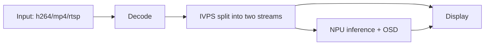
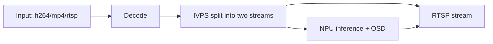
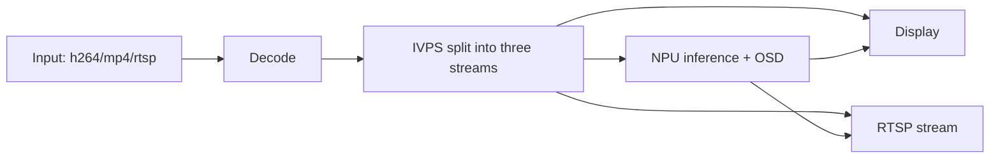
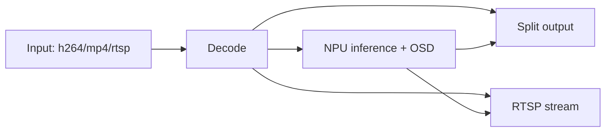
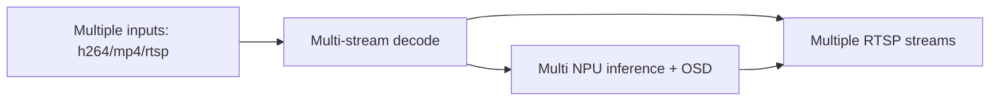
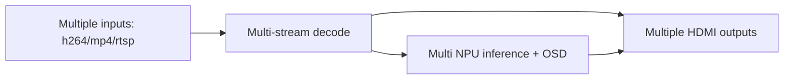
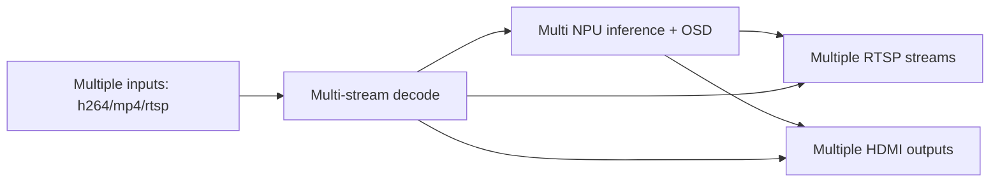

# ax-pipeline

## Overview

**AX-Pipeline** is developed by the community to demonstrate software usage patterns for the core features of the AXera-Pi series: NPU, encoding/decoding, and display. The project aims to help community developers quickly evaluate capabilities and adapt multimedia applications for Axera hardware.

### Supported chips

- AX650A/AX650N
- AX8850N/AX8850

### Supported SDK versions

- AX650 Series
    - v3.6.2 (community SDK: https://www.ebaina.com/down/240000038900)

### Supported development boards

- AX650N DEMO Board
- [AXera-Pi Pro](https://wiki.sipeed.com/m4ndock)(AX650N)

## Quick start

### Documentation

- [Quick compile](docs/compile.md) Simple cross-platform build using CMake.
- [How to replace your custom-trained YOLOv5 model](docs/how_to_deploy_custom_yolov5_model.md)
- [How to deploy your own models](docs/how_to_deploy_custom_model.md)
- [How to adjust image orientation](docs/how_to_adjust_image_orientation.md)
- [ModelZoo](docs/modelzoo.md) Lists supported and planned models with descriptions
- [Configuration file reference](docs/config_file.md)
- [Simplified pipeline build API](docs/new_pipeline.md)
- [How to speed up submodule downloads](docs/how_to_speed_up_submodule_init.md)
  
### Examples

| Example | Overview | Flowchart |
| - | - | - |
| [sample_demux_ivps_npu_vo](examples/sample_demux_ivps_npu_vo) | Read H264/MP4/RTSP, decode, split into two streams with IVPS: one for display and one for NPU inference | [See flowchart](#sample_demux_ivps_npu_vo) |
| [sample_demux_ivps_npu_rtsp](examples/sample_demux_ivps_npu_rtsp) | Read H264/MP4/RTSP, decode, split into two streams with IVPS: one for RTSP streaming and one for NPU inference | [See flowchart](#sample_demux_ivps_npu_rtsp) |
| [sample_demux_ivps_npu_rtsp_vo](examples/sample_demux_ivps_npu_rtsp_vo) | Read H264/MP4/RTSP, decode, split into three streams with IVPS: display, RTSP streaming, and NPU inference | [See flowchart](#sample_demux_ivps_npu_rtsp_vo) |
| [sample_demux_ivps_npu_hdmi_vo](examples/sample_demux_ivps_npu_hdmi_vo) | Read H264/MP4/RTSP, decode, run multiple model inferences and OSD, split the output (number of splits equals number of models), and output to HDMI | [See flowchart](#sample_demux_ivps_npu_hdmi_vo) |
| [sample_demux_ivps_npu_rtsp_hdmi_vo](examples/sample_demux_ivps_npu_rtsp_hdmi_vo) | Read H264/MP4/RTSP, decode, run multiple model inferences and OSD, split the output and stream to both HDMI and RTSP | [See flowchart](#sample_demux_ivps_npu_rtsp_hdmi_vo) |
| [sample_multi_demux_ivps_npu_multi_rtsp](examples/sample_multi_demux_ivps_npu_multi_rtsp) | Read multiple H264/MP4/RTSP streams, perform per-stream decoding, inference, and OSD, then output multiple RTSP streams | [See flowchart](#sample_multi_demux_ivps_npu_multi_rtsp) |
| [sample_multi_demux_ivps_npu_hdmi_vo](examples/sample_multi_demux_ivps_npu_hdmi_vo) | Read multiple H264/MP4/RTSP streams, perform per-stream decoding, inference, and OSD, then output to multiple HDMI displays | [See flowchart](#sample_multi_demux_ivps_npu_hdmi_vo) |
| [sample_multi_demux_ivps_npu_multi_rtsp_hdmi_vo](examples/sample_multi_demux_ivps_npu_multi_rtsp_hdmi_vo) | Read multiple H264/MP4/RTSP streams, perform per-stream inference and OSD, and output to multiple RTSP streams and HDMI displays | [See flowchart](#sample_multi_demux_ivps_npu_multi_rtsp_hdmi_vo) |

### sample_demux_ivps_npu_vo

### sample_demux_ivps_npu_rtsp

### sample_demux_ivps_npu_rtsp_vo

### sample_demux_ivps_npu_rtsp_hdmi_vo

### sample_multi_demux_ivps_npu_multi_rtsp

### sample_multi_demux_ivps_npu_hdmi_vo

### sample_multi_demux_ivps_npu_multi_rtsp_hdmi_vo

## Changelog

See the [Changelog](docs/update.md) for more details.

## Related projects

- [ax-samples](https://github.com/AXERA-TECH/ax-samples): Example implementations of common deep learning algorithms on Axera AI SoCs to help community developers evaluate and adapt quickly.
- [Deploy YOLO11 on AX650N (Chinese article)](https://zhuanlan.zhihu.com/p/772269394)
- [Deploy YOLOv8 on AX620Q (Chinese article)](https://zhuanlan.zhihu.com/p/683050593)
- [Pulsar2 Toolchain Documentation](https://pulsar2-docs.readthedocs.io/zh_CN/latest/)
- [Pulsar2 Toolchain (Pulsar2 Toolchain Documentation)](https://pulsar2-docs.readthedocs.io/zh_CN/latest/)  
    (For English documentation see: https://pulsar2-docs.readthedocs.io/ )

## Discussion / Support

- GitHub issues
- QQ Group: 139953715

## **Disclaimer**

*This project is intended for community technical exchange only and does not provide commercial delivery-quality guarantees.*
